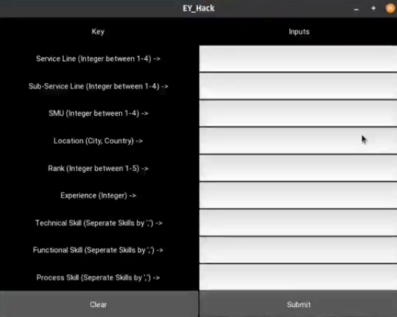
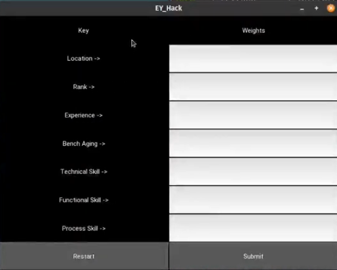
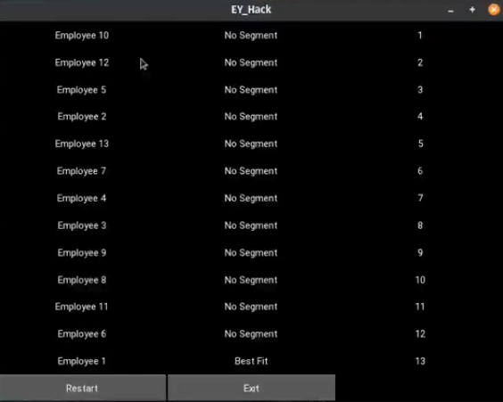

# Fitment Predictor

## Description
A Kivy based application to determine the fitment of an employee from the supply database for particular demand heuristics. A Fitment Score is calculated and based upon which the employee is categorized with the Fitment Segment, namely:
1.  Best Fit (85 and Above)
2.  Stretched Fit (70 to 85)
3.  Best Bet (60 to 70)
4.  No Segment (Below 60)

#### Fitment Score Calculation
A Score is calculated for each of the demand heuristic compared to the supply's attributes and the Fitment Score is calculated for the weightage given to the heuristic summing to 100%. The Heuristics considered for the calculation of Fitment Score are namely:
1.  **Location** of the employee(City, Country): [The great-circle distance](https://en.wikipedia.org/wiki/Great-circle_distance) between the demand location and the employee's location.
2.  Years of **Experience** of the employee: A Perfect score (weightage of attribute) for match, while a 10% decrease for every year short of the demand and a 1% increase for every year exceeding the demand.
3.  Hierarchical **Rank** of the employee: A perfect score for same rank as demand, while a 10% decrease for every rank lower than the demand and a 1% increase for every rank higher than the demand.
4.  **Bench Aging** of the employee: The number of weeks spent on the "Bench", i.e. number of weeks since not assigned to any project. A negative 10% decrement of assigned weight for every week spent on the bench.
5. **Skills** of the employee: The specific type of skill requirements of the demand are compared to all the same type of skills of the employee with a word embedding algorithm and the maximum matched skill value is taken along with the weight of the heuristic to calculate the score. Types of skills considered:  
    1. **Technical Skills** of the employee.
    2. **Functional Skills** of the employee.
    3. **Process Skills** of the employee.

#### Word Embedding
For the skill matching algorithm we have trained our own skill corpus using the open sourced gensim library, and it’s Word2Vec Bag-of-Words model. The learnt 100-dimensional embeddings are compared (Demand to that of Supply) using cosine similarity. Score is calculated by mutlipying the normalized cosine similarity with skill levels of the supply, and then choosing the max matched skilled. Download thefolder embedding vectors from [Word Embedding Models](https://drive.google.com/drive/folders/1vWsQAnS3z4-Ez314Y3AOGbRpof-Gx2sC?usp=sharing)

#### Ranking
Once the Fitment Scores and Segments are determined for each employee in the supply, the recommendation for the demand are ranked in each Segment according to the hierachical structure of the oraganization, i.e., Service Line -> Sub Service Line -> SMU/Business Unit. Implying the employees in the same SMU, SSL and SL are ranked higher while the employees with same SSL and SL but different SMU are ranked lower within each segment.  

## DataSet
The dataset acquired from the Hackathon page is extrapolated provided by the host themselves. The key sheets in the dataset are:
1.  Demand Sheet
2.  Supply Sheet ->
    1.  Non-Skills Supply
    2.  Skills Supply
3.  Skill Tree

## Required Libraries
1.  Pandas
2.  Numpy
3.  Kivy
4.  GenSim

## Instructions
```
git clone https://github.com/aaditagarwal/Fitment-Predictor.git
```
Download .zip file from [Word Embedding Models](https://drive.google.com/drive/folders/1vWsQAnS3z4-Ez314Y3AOGbRpof-Gx2sC?usp=sharing)\\
Extract the folder in the root directory as "models"
```
conda env create environment.yml
conda activate ey
python ey.py
```

## Screenshots
##### Deamnds Input Page


##### Weights Input Page


##### Results Page


##### Employee Details Page


## Demonstration of Project
1.  [Demonstration Video](https://drive.google.com/file/d/1j0nIOo-n2fU3n3nTq8BmANfGCm3Ox2L-/view?usp=sharing)
2.  [Presentation](https://docs.google.com/presentation/d/1pQhxA7BH9P6wIlJ6G_aoWw2_NRWiDYd8TBhh4RUMVmA/edit?usp=sharing)

## Contributors
1.	[Aadit Agarwal](https://github.com/aaditagarwal/)\
	ABV-IIITM, Gwalior\
	agarwal.aadit99@gmail.com
2.	[Aitik Gupta](https://github.com/aitikgupta)\
	ABV-IIITM, Gwalior\
	aitikgupta@gmail.com